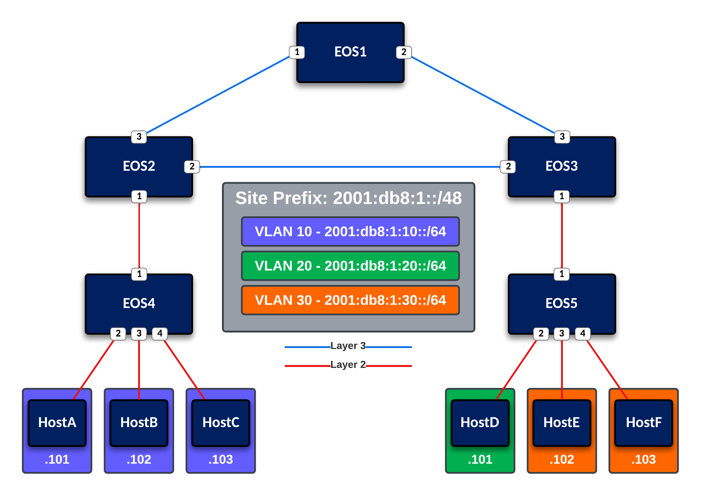

# ipv6-workshop

## Topology

### Starting the Lab

1. Clone this repository to a device that has [container lab](https://containerlab.dev) installed
2. Ensure the containerlab host has Arista cEOS-lab 4.31.3M or later imported
3. Launch the lab via `sudo clab deploy -t lab.yml`

If the containerlab host does not have cEOS-lab 4.31.3M or later imported:

1. Download cEOS-lab from [Arista Software Downloads](https://www.arista.com/en/support/software-download). This will require an arista.com login.
2. Navigate to cEOS-lab --> ***[version]*** --> cEOS64-lab-***[version]***.tar.xz
3. Once the `tar.xz` file is on the containerlab host, import it into docker via `sudo docker import`.

The following example demonstrates this command with a cEOS-lab version of 4.31.3M: `sudo docker import cEOS64-lab-4.31.3M.tar.xz ceos:latest`
